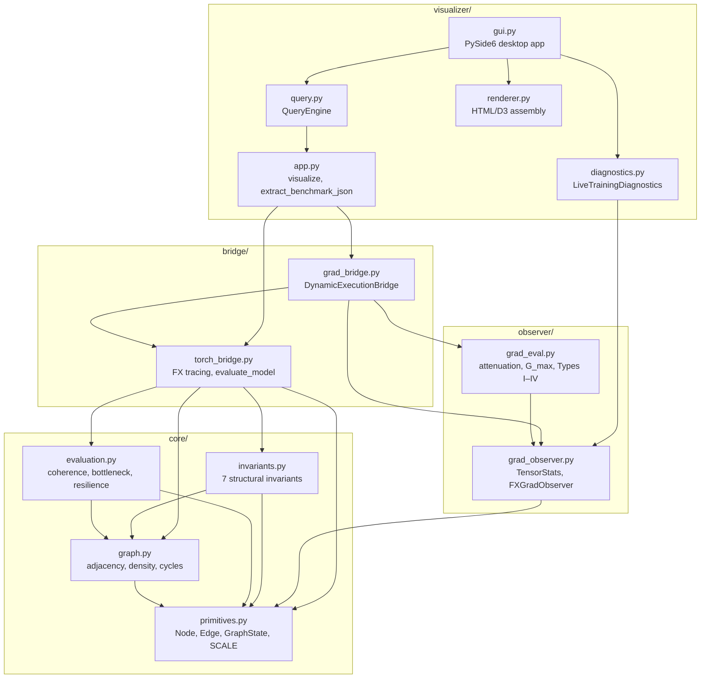

# Graphyco — Technical Documentation

Computational graph topology and dynamic gradient-flow monitoring for PyTorch neural networks.

---

## Table of Contents

- [Architecture Overview](#architecture-overview)
- [Mathematical Foundations](#mathematical-foundations)
  - [Deterministic Fixed-Point Arithmetic](#1-deterministic-fixed-point-arithmetic)
  - [Resource Representation & Non-Negative Stress](#2-resource-representation--non-negative-stress)
  - [Seven Enforced Graph Invariants](#3-seven-enforced-graph-invariants)
  - [Dynamic State Transitions & Schur Complement Update](#4-dynamic-state-transitions--schur-complement-update)
  - [Transition Metrics: Gromov-Wasserstein vs KL Divergence](#5-transition-metrics-gromov-wasserstein-vs-kl-divergence)
  - [Topological Observer Expressivity](#6-topological-observer-expressivity)
- [Static Topological Metrics](#static-topological-metrics)
- [Dynamic Gradient-Flow Telemetry](#dynamic-gradient-flow-telemetry)
  - [Tensor Statistics Engine](#1-tensor-statistics-engine)
  - [Edge Gradient Attenuation](#2-edge-gradient-attenuation)
  - [Dynamic Gradient Bottleneck](#3-dynamic-gradient-bottleneck-g_max)
  - [Forward-Backward Alignment](#4-forward-backward-alignment)
  - [Four-Quadrant Classification](#5-four-quadrant-structural-functional-classification)
  - [Temporal Stability & Anomaly Detection](#6-temporal-stability--anomaly-detection)
- [API Reference](#api-reference)
  - [`core.primitives`](#coreprimitivesspy)
  - [`core.graph`](#coregraphpy)
  - [`core.evaluation`](#coreevaluationpy)
  - [`core.invariants`](#coreinvariantspy)
  - [`bridge.torch_bridge`](#bridgetorch_bridgepy)
  - [`bridge.grad_bridge`](#bridgegrad_bridgepy)
  - [`observer.grad_observer`](#observergrad_observerpy)
  - [`observer.grad_eval`](#observergrad_evalpy)
  - [`visualizer.app`](#visualizerapppy)
  - [`visualizer.query`](#visualizerquerypy)
  - [`visualizer.diagnostics`](#visualizerdiagnosticspy)
  - [`visualizer.gui`](#visualizerguipy)
  - [`visualizer.renderer`](#visualizerrendererpy)
- [Empirical Validation Results](#empirical-validation-results)
  - [Static Validation Suite](#1-static-validation-suite)
  - [Dynamic Flow Benchmark Suite](#2-dynamic-flow-benchmark-suite)

---

## Architecture Overview

Graphyco maps neural network architectures into a formal computational state graph:

$$G_t = (V, E, X_t, A_t, G_t)$$

- **$V$ (Operational Nodes):** Computational units — layers, functions, torch operators, input/output placeholders.
- **$E$ (Directed Dependency Edges):** Directed dataflow dependencies classified as `operational`, `informational`, or `governance`.
- **$X_t$ (Structural Invariants & Capacity):** Fixed-point graph metrics, structural capacity vectors, and domain constants.
- **$A_t$ (Forward Activation Telemetry):** Forward tensor statistics (RMS, L1, L2, sparsity, mean, std) captured during execution.
- **$G_t$ (Backward Gradient Telemetry):** Backward tensor statistics across activation gradients, parameter gradients, and edge-intercepted gradients.

### Package Structure

```
src/graphyco/
├── __init__.py                     # Public API surface (18 exported symbols)
├── core/                           # Deterministic graph primitives & invariant verification
│   ├── primitives.py               # Node, Edge, CapacityVector, GraphState, checked arithmetic
│   ├── graph.py                    # Adjacency, density, degree metrics, DFS critical cycle detection
│   ├── evaluation.py               # Coherence, topological bottlenecks, perturbation resilience
│   └── invariants.py               # Seven enforced graph invariant validation rules
├── bridge/                         # PyTorch model translation & execution orchestration
│   ├── torch_bridge.py             # FX symbolic tracing, module fallback, parameter counting
│   └── grad_bridge.py              # DynamicExecutionBridge, DynamicGraphState, LiveTrainingMonitor
├── observer/                       # Observational runtime telemetry engine
│   ├── grad_observer.py            # TensorStats, EdgeAutogradHook, FXGradObserver, ModuleGradObserver
│   └── grad_eval.py                # Edge attenuation, dynamic bottleneck G_max, Types I–IV, temporal CV
├── visualizer/                     # Query engine, CLI, and PySide6 Desktop GUI
│   ├── app.py                      # visualize(), extract_benchmark_json()
│   ├── query.py                    # QueryEngine, query_metrics()
│   ├── diagnostics.py              # LiveTrainingDiagnostics, GradientHealthStatus
│   ├── renderer.py                 # D3 / HTML self-contained visualization assembly
│   ├── gui.py                      # VisualizerDesktopApp (PySide6 native Qt GUI)
│   └── __main__.py                 # CLI runner (python -m graphyco.visualizer)
└── tests/                          # Automated test suite (20 unit & integration tests)
    ├── test_dynamic_flow.py        # Dynamic gradient flow unit tests (12 tests)
    ├── test_visualizer.py          # Query engine & visualizer integration tests (8 tests)
    ├── test_torch_eval.py          # Standalone architecture evaluation runner
    └── test_compare.py             # Comparative topology runner
```

### Module Dependency Graph



---

## Mathematical Foundations

### 1. Deterministic Fixed-Point Arithmetic

All structural state metrics and invariant calculations are performed using 64-bit integer fixed-point arithmetic to guarantee bit-for-bit reproducibility across platforms and runs:

- **Fixed-Point Scale Factor:** $\text{SCALE} = 10{,}000$ (e.g., $1.0000 \to 10000$).
- **Integer Bounds:** Signed 64-bit range $[-2^{63}, 2^{63}-1]$.
- **Checked Arithmetic:** All additions and multiplications use `checked_add(a, b)` and `checked_mul(a, b)`, raising `OverflowError` if results exceed 64-bit bounds.
- **Accumulator Guard:** Matrix multiplications and vector reductions employ an intermediate 128-bit accumulator (`safe_mul`) before dividing by `SCALE` to eliminate integer overflow during covariance operations:

$$\text{safe\_mul}(a, b) = \left\lfloor \frac{\text{int128}(a) \times \text{int128}(b)}{\text{SCALE}} \right\rfloor$$

### 2. Resource Representation & Non-Negative Stress

To avoid unconstrained algebraic cancellation, resources are defined as an ordered real pair in $\mathbb{R} \times \mathbb{R}_{\ge 0}$:

$$R_v = (a_v, b_v)$$

- $a_v \in \mathbb{R}$: Available operational capacity / activation baseline.
- $b_v \in \mathbb{R}_{\ge 0}$: Accumulated structural stress, strictly non-negative ($\forall v \in V,\; b_v \ge 0$).
- **Pathological State Condition:** A node is in a pathological state if and only if $b_v > 0$:

$$\text{pathological}(v) \iff b_v > 0$$

When $b_v$ exceeds a collapse threshold $\theta_{\text{collapse}}$, stress is redistributed via explicit governed operations, ensuring $\sum_{v} b_v$ is non-decreasing without an explicit discharge event.

### 3. Seven Enforced Graph Invariants

`validate_invariants(state: GraphState)` verifies that the graph satisfies all seven structural invariants. Violation of any rule raises `InvariantViolationError(rule, detail)`.

| Invariant | Rule Identifier | Formal Requirement |
|---|---|---|
| **INV-1** | `node_id_format` | Every node ID must match `^[a-zA-Z0-9_-]+$`. |
| **INV-2** | `edge_integrity` | For every edge $e = (u, v)$, both $u \in V$ and $v \in V$. |
| **INV-3** | `port_connectivity` | Every output port produced by a node must be consumed as an input port by $\ge 1$ node. |
| **INV-4** | `node_uniqueness` | All node identifiers in $V$ must be distinct. |
| **INV-5** | `graph_liveness` | The graph must contain at least one active node ($\exists v \in V: v.\text{active} = \text{True}$). |
| **INV-6** | `attributes_nonempty` | Every node must contain $\ge 1$ descriptive attribute string. |
| **INV-7** | `acyclic_critical_subgraph` | The critical operational subgraph $G_{\text{crit}} = (V, E_{\text{critical}})$ must be a DAG with zero cycles. |

### 4. Dynamic State Transitions & Schur Complement Update

When new operational nodes are introduced (e.g., dynamic splitting $V \to V+1$), the covariance matrix $\Sigma \in \mathbb{R}^{V \times V}$ expands to:

$$\Sigma' = \begin{bmatrix} \Sigma & \mathbf{b} \\ \mathbf{b}^T & c \end{bmatrix}$$

where $\mathbf{b} \in \mathbb{R}^V$ is the covariance between the new node and existing nodes, and $c \in \mathbb{R}$ is the node variance. The inverse $(\Sigma')^{-1}$ is computed in $O(V^2)$ rather than $O(V^3)$ via the Schur complement:

$$(\Sigma')^{-1} = \begin{bmatrix} P + \frac{1}{S_{\text{safe}}} P \mathbf{b} \mathbf{b}^T P & -\frac{1}{S_{\text{safe}}} P \mathbf{b} \\ -\frac{1}{S_{\text{safe}}} \mathbf{b}^T P & \frac{1}{S_{\text{safe}}} \end{bmatrix}$$

where $P = \Sigma^{-1}$ is the prior inverse, and $S_{\text{safe}}$ applies deterministic Tikhonov regularization:

$$S_{\text{safe}} = \max\left(c - \mathbf{b}^T P \mathbf{b},\; \epsilon_{\min}\right)$$

with $\epsilon_{\min} \in \text{DomainConstants}$.

### 5. Transition Metrics: Gromov-Wasserstein vs KL Divergence

- **Topological Transitions (Variable Support):** When node splits, merges, or graph mutations alter the dimensionality of state space ($\mathcal{X}_N \to \mathcal{X}_{M}$), KL divergence is undefined ($D_{\text{KL}} \to \infty$). Structural distance is computed via the Gromov-Wasserstein distance:

$$GW_p(\mu, \nu) = \left( \inf_{\gamma \in \Pi(\mu, \nu)} \iint |d_{\mathcal{X}}(x, x') - d_{\mathcal{Y}}(y, y')|^p \, d\gamma(x, y) \, d\gamma(x', y') \right)^{1/p}$$

  To maintain temporal determinism, the Sinkhorn solver iteration count is bounded by a fixed invariant: $K_{\max} = \text{const} \in \text{DomainConstants}$.

- **Parametric Transitions (Fixed Support):** For transformations preserving graph topology (e.g., capacity adjustments, weight updates, phase shifts), divergence is measured via standard discrete $D_{\text{KL}}$.

### 6. Topological Observer Expressivity

Standard 1-Weisfeiler-Lehman (1-WL) graph isomorphism tests fail to detect cycles (e.g., cannot distinguish a 6-cycle from two disjoint 3-cycles). To preserve cycle sensitivity without the $O(V^k)$ memory explosion of $k$-WL ($k \ge 3$):

- Cycles of length 3, 4, 5, and 6 are extracted deterministically via depth-first traversal during structural mutations.
- The resulting counts form a static cycle feature vector $\mathbf{c}_v \in \mathbb{Z}^4$ attached to each node:

$$R_v = (a_v, b_v, \mathbf{c}_v)$$

---

## Static Topological Metrics

All metrics are implemented in [`core/evaluation.py`](../src/graphyco/core/evaluation.py) and return scaled integer values ($\text{SCALE} = 10{,}000$).

### 1. Graph Density ($D$)

Ratio of directed edges present to maximum possible directed edges:

$$D = \left\lfloor \frac{|E| \cdot \text{SCALE}}{|V|(|V|-1)} \right\rfloor$$

### 2. Connectivity Coherence ($C$)

Measures degree distribution uniformity across all nodes. With degree vector $\mathbf{d}$ and maximum variance $\text{MaxVar} = \frac{(N-1) \cdot \text{SCALE}^2}{N}$:

$$\bar{d} = \frac{1}{N}\sum_{i=1}^N d_i, \quad \sigma^2 = \frac{1}{N}\sum_{i=1}^N (d_i - \bar{d})^2$$

$$C = \text{SCALE} - \left\lfloor \frac{\sigma^2}{\text{MaxVar}} \cdot \text{SCALE} \right\rfloor, \quad C \in [0, \text{SCALE}]$$

- $C = 10{,}000$ indicates identical degree distribution across all nodes (perfect balance).
- Lower $C$ indicates concentrated hub architectures.

### 3. Topological Bottleneck Ratio ($B$)

Ratio of maximum node degree to mean node degree:

$$B = \left\lfloor \frac{\max_i(d_i) \cdot \text{SCALE}}{\bar{d}} \right\rfloor$$

- $B = 10{,}000$ ($1.0$) corresponds to perfectly uniform connectivity.
- $B > 1.5$ identifies structural choke nodes.

### 4. Perturbation Profile & Structural Perturbation Resilience ($R$)

Local cascade cost per node $i$:

$$\text{Cost}(i) = \underbrace{\max\left(1 + \left\lfloor \frac{d_i}{\text{SCALE}} \right\rfloor, 1\right)}_{\text{Primary}} + \underbrace{\sum_{j \in \mathcal{N}(i)} \max\left(\left\lfloor \frac{d_j}{\text{SCALE}} \right\rfloor, 1\right)}_{\text{Secondary}}$$

Structural perturbation resilience across graph order $N = |V|$:

$$R = \left\lfloor \frac{N \cdot \text{SCALE}}{\sum_{i=1}^N \text{Cost}(i)} \right\rfloor$$

### 5. Fan Balance & Dead Ratio

- **Fan-in / Fan-out Imbalance:**

$$\text{imbalance}(v) = \left\lfloor \frac{|f_{\text{in}}(v) - f_{\text{out}}(v)| \cdot \text{SCALE}}{f_{\text{in}}(v) + f_{\text{out}}(v)} \right\rfloor$$

- **Dead Ratio:** Fraction of isolated nodes with zero incoming and outgoing edges:

$$\text{dead\_ratio} = \left\lfloor \frac{|V_{\text{isolated}}| \cdot \text{SCALE}}{|V|} \right\rfloor$$

### 6. Critical Path Density

Ratio of critical edges to total edges:

$$\text{CPD} = \frac{|E_{\text{critical}}| \cdot \text{SCALE}}{|E|}$$

---

## Dynamic Gradient-Flow Telemetry

Implemented across [`observer/grad_observer.py`](../src/graphyco/observer/grad_observer.py) and [`observer/grad_eval.py`](../src/graphyco/observer/grad_eval.py).

### 1. Tensor Statistics Engine

`TensorStats` computes observational metrics over detached float64 representations without modifying autograd computation:

| Metric | Formula |
|---|---|
| Element Count | $N = \text{numel}(T)$ |
| $L_1$ Norm | $L_1 = \sum \|x_i\|$ |
| $L_2$ Norm | $L_2 = \sqrt{\sum x_i^2}$ |
| RMS | $\text{RMS} = \frac{L_2}{\sqrt{N}} = \sqrt{\frac{1}{N}\sum_{i=1}^N x_i^2}$ |
| Mean, Std | $\mu$, $\sigma$ |
| Sparsity | $\frac{\sum \mathbb{I}[x_i = 0]}{N}$ |
| Non-Finite Fraction | $\frac{\sum \mathbb{I}[\neg \text{isfinite}(x_i)]}{N}$ |
| Fixed-Point RMS | $\text{round}(\text{RMS} \cdot \text{SCALE})$ |

### 2. Edge Gradient Attenuation

For directed edge $e = (\text{source} \to \text{target})$:

$$\alpha_{\text{forward}} = \frac{\|g_{\text{source}}\|_2}{\|g_{\text{target}}\|_2 + \epsilon}$$

$$\beta_{\text{backward}} = \frac{\|g_{\text{target}}\|_2}{\|g_{\text{source}}\|_2 + \epsilon}$$

$$\Delta = \ln\left(\frac{\|g_{\text{source}}\|_2 + \epsilon}{\|g_{\text{target}}\|_2 + \epsilon}\right)$$

- $\Delta < 0$: Gradient attenuates as it flows backward toward the input.
- $\Delta > 0$: Gradient amplifies along the backward path.

### 3. Dynamic Gradient Bottleneck ($G_{\max}$)

Concentration of backward gradient energy relative to uniform flow:

$$q_i = \frac{g_i}{\frac{1}{|V|}\sum_{j \in V} g_j + \epsilon}, \quad G_{\max} = \max_{i \in V} q_i, \quad v^* = \arg\max_{i \in V} q_i$$

where $g_i$ is the normalized gradient RMS of node $i$, and $v^*$ is the **choke node**.

### 4. Forward-Backward Alignment

Quantifies the relationship between activation magnitude $a_i = \text{RMS}(A_i)$ and gradient magnitude $g_i = \text{RMS}(G_i)$:

- **Local Sensitivity Ratio:** $r_i = \frac{g_i}{a_i + \epsilon}$
- **Spearman Rank Correlation:** $\rho_{AG} = \text{spearmanr}(\mathbf{a}, \mathbf{g})$
- **Pearson Linear Correlation:** $r_{AG} = \text{pearsonr}(\mathbf{a}, \mathbf{g})$

### 5. Four-Quadrant Structural-Functional Classification

Nodes are partitioned by median splits on static topology perturbation score ($t_i$) and dynamic gradient RMS ($g_i$):

| Quadrant | Structural Importance | Gradient Flux | Functional Role |
|---|---|---|---|
| **Type I** | High ($t_i \ge \tilde{t}$) | High ($g_i \ge \tilde{g}$) | **Dual Hub:** Central structural router carrying high computational signal. |
| **Type II** | High ($t_i \ge \tilde{t}$) | Low ($g_i < \tilde{g}$) | **Structural Hub / Low Flux:** High connectivity but suppressed gradient flow. |
| **Type III** | Low ($t_i < \tilde{t}$) | High ($g_i \ge \tilde{g}$) | **Dynamic Conduit:** Peripheral structure absorbing disproportionate gradient flux. |
| **Type IV** | Low ($t_i < \tilde{t}$) | Low ($g_i < \tilde{g}$) | **Peripheral:** Low structural impact and low gradient activity. |

### 6. Temporal Stability & Anomaly Detection

Tracks node behavior across execution steps $t = 1, \dots, T$:

**Temporal Coefficient of Variation:**

$$\text{CV}_i = \frac{\sigma_{g_i}}{|\mu_{g_i}| + \epsilon}$$

**Behavioral Classification:**
- `intermittent`: Zero-gradient fraction $> 0.30$.
- `unstable`: $\text{CV}_i > 0.50$.
- `consistently_strong`: $\mu_{g_i} \ge \text{median}(\boldsymbol{\mu}_g)$ with low variance.
- `consistently_weak`: $\mu_{g_i} < \text{median}(\boldsymbol{\mu}_g)$.

**Anomaly Detection:**
- **Vanishing Nodes:** $g_i < \tau_{\text{low}}$ (default: absolute $10^{-6}$ or relative $0.01 \times \tilde{g}$).
- **Exploding Nodes:** $g_i > \tau_{\text{high}}$ (default: absolute $100.0$ or relative $100.0 \times \tilde{g}$).

---

## API Reference

### `core/primitives.py`

Core data structures and deterministic arithmetic for the graph state kernel.

#### Constants

| Constant | Type | Value | Description |
|---|---|---|---|
| `SCALE` | `int` | `10000` | Fixed-point scale factor. $1.0 = 10{,}000$. |
| `NODE_ID_PATTERN` | `Pattern` | `^[a-zA-Z0-9_-]+$` | Valid node identifier regex. |

#### Functions

```python
validate_node_id(node_id: str) -> None
```
Validates node ID format against `NODE_ID_PATTERN`. Raises `ValueError` on mismatch.

```python
checked_add(a: int, b: int) -> int
```
Safe 64-bit integer addition. Raises `OverflowError` if result exceeds $[-2^{63}, 2^{63}-1]$.

```python
checked_mul(a: int, b: int) -> int
```
Safe 64-bit integer multiplication. Raises `OverflowError` if result exceeds $[-2^{63}, 2^{63}-1]$.

#### Classes

**`Node`** (dataclass)

| Field | Type | Default | Description |
|---|---|---|---|
| `id` | `str` | — | Unique identifier matching `NODE_ID_PATTERN` |
| `name` | `str` | — | Human-readable name |
| `purpose` | `str` | — | Functional description or module class |
| `attributes` | `List[str]` | `[]` | Structural attributes (e.g., `"in=64"`, `"bias"`) |
| `in_ports` | `List[str]` | `[]` | Input port names |
| `out_ports` | `List[str]` | `[]` | Output port names |
| `phase` | `str` | `'nascent'` | Lifecycle state |
| `active` | `bool` | `True` | Liveness flag |

**`Edge`** (dataclass)

| Field | Type | Default | Description |
|---|---|---|---|
| `source` | `str` | — | Source node ID |
| `target` | `str` | — | Target node ID |
| `edge_type` | `str` | `'operational'` | `'operational'`, `'informational'`, or `'governance'` |
| `critical` | `bool` | `False` | Critical dependency for DAG cycle constraints |

**`CapacityVector`** (dataclass)

| Field | Type | Default | Description |
|---|---|---|---|
| `axes` | `Dict[str, int]` | `{}` | Capacity dimensions mapped to integer values |

Methods: `to_dict()`, `capacity_index() -> int` (integer mean of all axes).

**`DomainConstants`** (frozen dataclass)

| Field | Type | Default | Description |
|---|---|---|---|
| `fission_threshold` | `int` | `3` | Node split threshold |
| `fission_min_capacity` | `int` | `60000` | Minimum capacity for fission |
| `fusion_max_attributes` | `int` | `5` | Maximum attributes for fusion |
| `cascade_failure_threshold` | `int` | `8` | Cascade failure trigger |
| `cascade_debt_base_multiplier` | `int` | `1` | Base debt on cascade |
| `deferred_split_debt_increment` | `int` | `1` | Debt for deferred splits |

**`GraphState`** (dataclass)

| Field | Type | Default | Description |
|---|---|---|---|
| `nodes` | `Dict[str, Node]` | `{}` | Node registry |
| `edges` | `List[Edge]` | `[]` | Edge list |
| `capacity_vector` | `CapacityVector` | `CapacityVector()` | Aggregate capacity |
| `constants` | `DomainConstants` | `DomainConstants()` | Domain configuration |
| `phase` | `str` | `'nascent'` | Graph lifecycle phase |
| `structural_debt` | `int` | `0` | Accumulated structural debt |
| `event_history` | `List[dict]` | `[]` | Transition event log |

Methods: `copy() -> GraphState` (deepcopy), `to_dict() -> dict`.

---

### `core/graph.py`

Graph topology algorithms: adjacency, density, degree metrics, and cycle detection.

#### Functions

```python
build_adjacency_map(edges: List[Edge]) -> Dict[str, List[str]]
```
Builds directed adjacency dictionary `source → [targets]`.

```python
compute_graph_density(state: GraphState) -> int
```
Directed graph density in fixed-point: $|E| \cdot \text{SCALE} \;/\; |V|(|V|-1)$.

```python
compute_local_density(node_id: str, state: GraphState) -> int
```
Node incidence ratio: `(incident edges) * SCALE // |E|`.

```python
find_isolated_nodes(state: GraphState) -> List[str]
```
Returns sorted list of nodes with zero incident edges.

```python
in_degree(node_id: str, edges: List[Edge]) -> int
out_degree(node_id: str, edges: List[Edge]) -> int
```
Count incoming / outgoing edges for a node.

```python
detect_critical_cycles(state: GraphState) -> List[List[str]]
```
Iterative DFS over the critical-edge subgraph using 3-color marking (`WHITE`, `GREY`, `BLACK`). Returns all directed cycles as node-ID lists.

---

### `core/evaluation.py`

Master evaluation suite computing all static topological metrics. Every function takes a `GraphState` and returns fixed-point integers.

#### Functions

```python
connectivity_coherence(state: GraphState) -> int
```
Degree distribution uniformity. Returns value in $[0, \text{SCALE}]$. See [§ Connectivity Coherence](#2-connectivity-coherence-c).

```python
topological_bottleneck_ratio(state: GraphState) -> int
```
Peak degree concentration. See [§ Topological Bottleneck Ratio](#3-topological-bottleneck-ratio-b).

```python
fan_balance(state: GraphState) -> Dict[str, Dict[str, int]]
```
Per-node `{fan_in, fan_out, imbalance}`. See [§ Fan Balance](#5-fan-balance--dead-ratio).

```python
dead_ratio(state: GraphState) -> int
```
Fraction of isolated nodes. See [§ Dead Ratio](#5-fan-balance--dead-ratio).

```python
cycle_pressure(state: GraphState) -> int
```
Count of critical cycles in the graph.

```python
perturbation_profile(state: GraphState) -> Dict[str, int]
```
Per-node cascade cost under removal. See [§ Perturbation Profile](#4-perturbation-profile--structural-perturbation-resilience-r).

```python
structural_perturbation_resilience(state: GraphState) -> int
```
Global resilience score. See [§ Resilience](#4-perturbation-profile--structural-perturbation-resilience-r).

```python
critical_path_density(state: GraphState) -> int
```
Ratio of critical to total edges. See [§ Critical Path Density](#6-critical-path-density).

```python
evaluate(state: GraphState) -> Dict
```
Master evaluation returning all metrics: node/edge counts, density, coherence, bottleneck ratio, dead ratio, cycle pressure, resilience, critical path density, isolated nodes, critical cycles, perturbation profile, fan balance, structural debt, and phase.

---

### `core/invariants.py`

Structural integrity validation.

#### Classes

```python
class InvariantViolationError(Exception):
    def __init__(self, rule: str, detail: str)
```
Raised when a graph invariant is violated. Attributes: `self.rule`, `self.detail`.

#### Functions

```python
validate_invariants(state: GraphState) -> None
```
Executes all 7 invariant checks. Raises `InvariantViolationError` on the first violation. See [§ Seven Enforced Graph Invariants](#3-seven-enforced-graph-invariants).

---

### `bridge/torch_bridge.py`

PyTorch FX tracing and module-level graph extraction.

#### Functions

```python
module_to_graph(
    model: nn.Module,
    include_containers: bool = False,
    min_params: int = 0
) -> GraphState
```
Recursive `nn.Module` inspection fallback. Creates nodes for leaf modules, links parent→child hierarchical edges (operational, non-critical) and sequential sibling edges (operational, critical). Use when FX tracing is unsupported (dynamic control flow, RNNs, C++ bindings).

```python
trace_to_graph(
    model: nn.Module,
    concrete_args: Optional[Dict] = None
) -> GraphState
```
Uses `torch.fx.symbolic_trace` to translate the FX IR into `GraphState`. Maps `args` to operational critical edges and `kwargs` to informational non-critical edges. Handles `call_module`, `call_function`, `call_method`, `placeholder`, and `output` opcodes.

```python
evaluate_model(
    model: nn.Module,
    mode: str = 'trace',
    concrete_args: Optional[Dict] = None
) -> Dict
```
Static model profiling. Returns:
- `graph_state`: The extracted `GraphState`
- `evaluation`: All static topological metrics
- `model_info`: `{total_parameters, trainable_parameters, layer_types}`

| `mode` | Strategy | When to Use |
|---|---|---|
| `"trace"` | PyTorch FX symbolic tracing | Standard feedforward models (MLP, CNN, ResNet, Transformer encoders) |
| `"module"` | Recursive `nn.Module` inspection | Dynamic control flow, RNNs, third-party C++ bindings |

```python
evaluate_model_dynamic(
    model: nn.Module,
    inputs: torch.Tensor,
    loss_fn: Optional[Callable] = None,
    mode: str = "trace",
    concrete_args: Optional[Dict] = None
) -> Dict[str, Any]
```
Combined static + dynamic evaluation via `DynamicExecutionBridge`.

---

### `bridge/grad_bridge.py`

Dynamic execution orchestration and live training integration.

#### Classes

**`DynamicGraphState`** (dataclass)

The unified formal state $G_t = (V, E, X_t, A_t, G_t)$ at a single execution step.

| Field | Type | Description |
|---|---|---|
| `graph_state` | `GraphState` | Static graph structure |
| `step` | `int` | Execution step index |
| `node_records` | `Dict[str, DynamicNodeRecord]` | Per-node activation and gradient telemetry |
| `edge_records` | `Dict[Tuple[str,str], TensorStats]` | Per-edge intercepted gradient statistics |
| `static_evaluation` | `Dict[str, Any]` | Static topological metrics |
| `dynamic_evaluation` | `Dict[str, Any]` | Dynamic gradient-flow metrics (bottleneck, attenuation, alignment, classification, temporal) |

Methods:
- `to_dict() -> Dict[str, Any]`
- `to_json(path: Optional[str], indent: int = 2) -> str` — Serialize to JSON file or string.
- `to_csv_nodes(path: Optional[str]) -> str` — Export node telemetry to CSV.

---

**`DynamicExecutionBridge`**

Coordinates static DAG extraction, forward activation recording, backward gradient capture, and dynamic metric evaluation.

```python
DynamicExecutionBridge(
    model: nn.Module,
    mode: str = "trace",
    concrete_args: Optional[Dict] = None,
    record_edges: bool = True
)
```

| Method | Description |
|---|---|
| `step(inputs, target, loss_fn, optimizer) -> DynamicGraphState` | Execute one forward-backward pass, compute all metrics, optionally update parameters |
| `run_training_trajectory(dataloader, loss_fn, optimizer, steps) -> List[DynamicGraphState]` | Multi-step recording across batch sequences |

The `step()` method executes this pipeline:
1. Forward pass → record node activations
2. Compute loss (`loss_fn(output, target)` or `output.sum()`)
3. Backward pass → `loss.backward()`
4. Capture module parameter gradients
5. Extract `DynamicNodeRecord` and `TensorStats`
6. Run `evaluate_dynamic_flow(...)` for all dynamic metrics
7. Optional `optimizer.step()`

---

**`LiveTrainingMonitor`**

Non-intrusive context manager for active training loops.

```python
LiveTrainingMonitor(
    model: nn.Module,
    mode: str = "trace",
    concrete_args: Optional[Dict] = None,
    log_interval: int = 1,
    record_edges: bool = True
)
```

| Method | Returns | Description |
|---|---|---|
| `observe(step: int)` | Context manager | Wraps a training step to capture telemetry every `log_interval` steps |
| `has_new_data()` | `bool` | Whether new telemetry is available since last check |
| `get_latest_state()` | `Optional[DynamicGraphState]` | Most recent full state snapshot |
| `get_latest_bottleneck()` | `Dict[str, Any]` | `{bottleneck_node, max_concentration}` |
| `get_live_anomalies()` | `Dict[str, Any]` | Vanishing and exploding node lists |
| `get_temporal_stability()` | `Dict[str, Any]` | Per-node CV and classification |
| `export_live_json(path, indent)` | `None` | Export current state to JSON file |

#### Functions

```python
monitor_model(
    model: nn.Module,
    inputs: torch.Tensor,
    loss_fn: Optional[Callable] = None,
    mode: str = "trace",
    concrete_args: Optional[Dict] = None
) -> DynamicGraphState
```
One-line convenience function: runs a single forward-backward pass and returns the `DynamicGraphState`.

---

### `observer/grad_observer.py`

Low-level telemetry capture: tensor statistics, autograd hooks, and observation engines.

#### Classes

**`TensorStats`** (dataclass)

| Field | Type | Description |
|---|---|---|
| `numel` | `int` | Element count $N$ |
| `mean` | `float` | Mean $\mu$ |
| `std` | `float` | Standard deviation $\sigma$ |
| `min_val` | `float` | Minimum value |
| `max_val` | `float` | Maximum value |
| `l1_norm` | `float` | $L_1 = \sum \|x_i\|$ |
| `l2_norm` | `float` | $L_2 = \sqrt{\sum x_i^2}$ |
| `rms` | `float` | $\text{RMS} = L_2 / \sqrt{N}$ |
| `zero_fraction` | `float` | Sparsity ratio |
| `non_finite_fraction` | `float` | NaN/Inf ratio |
| `normalized_magnitude` | `float` | Equal to RMS |
| `fixed_point_rms` | `int` | $\text{round}(\text{RMS} \cdot \text{SCALE})$ |

**`EdgeAutogradHook`** (`torch.autograd.Function`)

Observational identity function injected along graph edges. Forward returns `tensor.view_as(tensor)` (no-op). Backward intercepts the directed edge gradient into a sink dictionary before normal accumulation.

**`DynamicNodeRecord`** (dataclass)

| Field | Type | Description |
|---|---|---|
| `node_id` | `str` | Node identifier |
| `node_type` | `str` | Node operation type |
| `activation` | `Optional[TensorStats]` | Forward activation statistics |
| `activation_gradient` | `Optional[TensorStats]` | $dL/dx$ statistics |
| `parameter_gradient` | `Optional[TensorStats]` | $dL/dW$ statistics |
| `ratio_grad_act` | `Optional[float]` | Sensitivity ratio $g/a$ |
| `has_parameters` | `bool` | Whether node has learnable parameters |

**`FXGradObserver`** (extends `torch.fx.Interpreter`)

Executes the FX graph node-by-node, injecting `EdgeAutogradHook` on edge inputs, capturing activation tensors, registering backward hooks for $dL/dx_i$, and collecting parameter gradients $dL/dW_i$.

Methods: `reset()`, `run_node(n)`, `capture_parameter_gradients()`, `extract_records(eps=1e-8)`.

**`ModuleGradObserver`**

Hook-based observer for `nn.Module` hierarchies. Attaches `register_forward_hook` and `register_full_backward_hook` to leaf modules.

Methods: `reset()`, `capture_parameter_gradients()`, `remove_hooks()`, `extract_records(eps=1e-8)`.

#### Functions

```python
compute_tensor_stats(t: Optional[torch.Tensor], scale: int = SCALE) -> Optional[TensorStats]
```
Converts tensor to detached float64, replaces non-finites via `torch.nan_to_num`, and computes all statistics.

---

### `observer/grad_eval.py`

Dynamic gradient-flow evaluation algorithms. All mathematical details are documented in [§ Dynamic Gradient-Flow Telemetry](#dynamic-gradient-flow-telemetry).

#### Data Structures

| Dataclass | Key Fields | Description |
|---|---|---|
| `EdgeAttenuation` | `source, target, forward_ratio, backward_ratio, log_forward_ratio, log_backward_ratio, edge_grad_rms` | Per-edge gradient flow ratios |
| `GradientBottleneckResult` | `node_concentrations, max_concentration, bottleneck_node, mean_gradient, median_gradient` | Dynamic bottleneck $G_{\max}$ |
| `ForwardBackwardAlignment` | `node_sensitivity_ratios, spearman_rho, spearman_pvalue, pearson_r, pearson_pvalue` | Activation-gradient correlation |
| `TopologyGradientClassification` | `node_categories, type_i/ii/iii/iv_nodes, spearman_topo_grad` | Four-quadrant partitioning |
| `TemporalNodeStats` | `node_id, steps, mean_gradient, std_gradient, cv, classification` | Per-node temporal behavior |
| `AnomalyDetectionResult` | `vanishing_nodes, exploding_nodes, low_threshold, high_threshold` | Anomaly detection output |

#### Functions

```python
compute_gradient_attenuation(node_records, edge_records, graph_state, eps) -> Dict[Tuple, EdgeAttenuation]
compute_gradient_bottleneck(node_records, eps) -> GradientBottleneckResult
compute_forward_backward_alignment(node_records, eps) -> ForwardBackwardAlignment
compute_topology_gradient_correspondence(node_records, graph_state, eps) -> TopologyGradientClassification
compute_temporal_stability(trajectory, eps) -> Dict[str, TemporalNodeStats]
detect_gradient_anomalies(node_records, mode, absolute_low, absolute_high, relative_low_factor, relative_high_factor) -> AnomalyDetectionResult
evaluate_dynamic_flow(node_records, edge_records, graph_state, trajectory, eps) -> Dict[str, Any]
```

`evaluate_dynamic_flow` is the master coordinator that runs all six analyses and returns a unified dictionary.

---

### `visualizer/app.py`

High-level application entrypoints: profiling, export, HTTP serving, and visualization.


#### Functions

```python
extract_benchmark_json(
    target: Union[nn.Module, LiveTrainingMonitor, DynamicExecutionBridge, str],
    inputs: Optional[torch.Tensor] = None,
    loss_fn: Optional[Callable] = None,
    steps: int = 5,
    arch_name: Optional[str] = None,
    export_path: Optional[str] = None
) -> Dict[str, Any]
```
End-to-end benchmark export pipeline. Accepts models, monitors, bridges, or the string `"all"` (for canonical models). Returns a dictionary with keys `architectures`, `step_trajectories`, `ablation_validation`. If `export_path` is provided, writes JSON to disk.

```python
compute_ablation_map(graph_state: GraphState) -> Dict[str, float]
```
BFS-based reachability collapse for each node: $\text{Loss}(v) = (\text{baseline} - \text{reachability}(G \setminus \{v\})) / \text{baseline}$.

```python
get_canonical_models() -> Dict[str, Tuple[nn.Module, torch.Tensor]]
```
Returns 5 canonical benchmark models: Sequential MLP, ResNet Block, DenseBlock, U-Net Toy, Self-Attention Toy.

```python
visualize(
    target, inputs=None, loss_fn=None, steps=5,
    open_browser=True, export_html=None
) -> None
```
High-level entrypoint: profiles the model, exports benchmark JSON, and launches the desktop visualization app or browser.

```python
visualize_inline(target, inputs=None, loss_fn=None, steps=5)
```
Embeds visualization directly in Jupyter notebooks via `IPython.display.HTML`.

---

### `visualizer/query.py`

Offline analytics engine for serialized benchmark JSONs or in-memory models.

#### Classes

**`QueryEngine`**

```python
QueryEngine(
    data: Union[str, Dict, nn.Module],
    inputs: Optional[torch.Tensor] = None,
    steps: int = 10,
    arch_name: Optional[str] = None
)
```

| Method | Returns | Description |
|---|---|---|
| `list_architectures()` | `List[str]` | All loaded architecture names |
| `set_default(arch)` | `None` | Set the active default architecture |
| `describe(arch, siblings, include_description)` | `pd.DataFrame` | Invariant summary or cross-architecture comparison table |
| `get_summary(arch)` | `Dict` | Static + dynamic metric summary |
| `get_bottlenecks()` | `List[Dict]` | Comparative bottleneck ranking across architectures |
| `get_neighbors(node_id, arch)` | `Dict` | `{predecessors, successors, siblings}` from DAG adjacency |
| `get_siblings(node_id, arch)` | `List[str]` | Nodes sharing common parent inputs |
| `get_nodes(arch, category, has_params)` | `List[Dict]` | Filterable node telemetry records |
| `get_node_telemetry(node_id, arch, step)` | `Dict` | Detailed single-node metrics at step $t$ |
| `get_step_trajectory(arch, step)` | `List[Dict]` | Multi-step trajectory playback records |
| `get_attenuation(arch)` | `List[Dict]` | Edge gradient attenuation ratios |
| `get_anomalies(arch)` | `Dict` | Vanishing and exploding nodes |
| `get_ablation(arch)` | `Dict[str, float]` | Node ablation reachability loss map |
| `query(arch, node, metric, step, category)` | `Any` | Universal query dispatcher |

Class method:
```python
QueryEngine.from_model(model, inputs=None, steps=10, arch_name=None) -> QueryEngine
```

#### Functions

```python
query_metrics(
    target: Union[nn.Module, str, Dict],
    inputs: Optional[torch.Tensor] = None,
    steps: int = 10,
    arch_name: Optional[str] = None,
    metric: str = "summary"
) -> Any
```
Direct in-memory metric query without file I/O. Supports `metric` values: `"summary"`, `"bottlenecks"`, `"nodes"`, `"attenuation"`, `"anomalies"`, `"ablation"`.

---

### `visualizer/diagnostics.py`

Thread-safe runtime health monitoring for active training loops.

#### Classes

**`GradientHealthStatus`**

Status constants for gradient health:

| Constant | Value |
|---|---|
| `HEALTHY` | `"HEALTHY"` |
| `WARNING_VANISHING` | `"WARNING: Vanishing Gradients"` |
| `WARNING_EXPLODING` | `"WARNING: Exploding Gradients"` |
| `CRITICAL_NAN_INF` | `"CRITICAL: NaN or Inf Detected"` |
| `WARNING_DEAD_NEURONS` | `"WARNING: High Dead Neuron Ratio"` |

**`LiveTrainingDiagnostics`**

```python
LiveTrainingDiagnostics(
    model: nn.Module,
    inputs: torch.Tensor,
    vanishing_threshold: float = 1e-6,
    exploding_threshold: float = 50.0,
    dead_neuron_threshold: float = 0.5,
    history_len: int = 100
)
```

| Method | Returns | Description |
|---|---|---|
| `observe_step(step, loss)` | Context manager | Wraps a training step; times execution, captures hooks |
| `get_snapshot()` | `Dict[str, Any]` | Thread-safe snapshot: status, bottleneck layer, $G_{\max}$, avg step time, layer telemetry, alerts |
| `close()` | `None` | Remove all PyTorch hooks |

The snapshot dictionary includes:
- `status`: `GradientHealthStatus` value
- `active_bottleneck`: Layer ID with highest $G_{\max}$
- `gmax_value`: Current $G_{\max}$ concentration
- `avg_step_time_ms`: Running average step duration
- `layer_telemetry`: Per-layer `{grad_rms, act_rms, dead_neuron_ratio}`
- `alerts`: List of triggered anomaly alerts

---

### `visualizer/gui.py`

Native PySide6 desktop GUI for real-time visualization.

> **Dependency:** Requires `PySide6` and optionally `PySide6-WebEngine`.

#### Classes

**`VisualizerDesktopApp`** (extends `QMainWindow`)

```python
VisualizerDesktopApp(data=None, diagnostics=None)
```

Three-tab layout:
1. **Graph Flow & Telemetry** — Embedded `QWebEngineView` rendering interactive D3/SVG flow visualization via `Renderer`.
2. **Live Training Diagnostics** — Real-time KPI cards (Step, Loss, Health Status, Dynamic Bottleneck), live layer telemetry table, scrolling alert feed. Polls `LiveTrainingDiagnostics.get_snapshot()` every 200ms via `QTimer`.
3. **Invariant & Bottleneck Inspector** — Static topological and dynamic invariant tables.

| Method | Description |
|---|---|
| `load_data(data)` | Load benchmark JSON or dictionary |
| `_render_graph_view()` | Render the D3 flow visualization |
| `_populate_invariants_table()` | Fill invariants tab |
| `_poll_live_diagnostics()` | Timer callback (200ms) updating live telemetry |
| `_open_json_dialog()` | File → Open JSON dialog |

#### Functions

```python
launch_desktop_app(data=None, diagnostics=None) -> VisualizerDesktopApp
```
Instantiates `QApplication` (if needed) and launches the native GUI window. Pass `diagnostics` (a `LiveTrainingDiagnostics` instance) for real-time training monitoring.

---

### `visualizer/renderer.py`

Self-contained HTML/CSS/JS visualization assembly.

#### Classes

**`Renderer`**

```python
Renderer()
```

| Method | Returns | Description |
|---|---|---|
| `static_dir` | `Path` | Path to static assets directory |
| `assemble(data)` | `str` | Complete self-contained HTML string with inlined CSS/JS and embedded JSON |
| `export(data, path)` | `str` | Write self-contained HTML to disk for portable sharing |

Templating replaces `<!-- INLINE_CSS_PLACEHOLDER -->`, `<!-- INLINE_JS_PLACEHOLDER -->`, and `<!-- DATA_PLACEHOLDER -->` with the corresponding inlined content.

---

## Empirical Validation Results

### 1. Static Validation Suite

Six controlled protocols executed across canonical architecture families (see [`validation/validate_framework.py`](../validation/validate_framework.py)):

#### Protocol 1: Architectural Discriminability

| Architecture | Nodes ($\|V\|$) | Edges ($\|E\|$) | Density ($D$) | Coherence ($C$) | Bottleneck ($B$) | Resilience ($R$) |
|---|---|---|---|---|---|---|
| Sequential MLP | 9 | 8 | 0.1111 | 0.9970 | 1.1251 | 0.3600 |
| Feedforward CNN | 9 | 8 | 0.1111 | 0.9970 | 1.1251 | 0.3600 |
| ResNet Block | 8 | 9 | 0.1607 | 0.9956 | 1.5000 | 0.3333 |
| DenseNet Block | 12 | 17 | 0.1287 | 0.9951 | 1.7653 | 0.2608 |
| U-Net Toy | 14 | 14 | 0.0769 | 0.9985 | 1.5000 | 0.3333 |
| Self-Attention Toy | 10 | 12 | 0.1333 | 0.9951 | 1.6673 | 0.2941 |

Sequential MLP and CNN produce identical topological metrics due to identical sequential dependency structures. DenseNet exhibits maximum connectivity dispersion ($B=1.7653$), while Self-Attention exhibits high concentration ($B=1.6673$).

#### Protocol 2: Controlled Synthetic Confounder Isolation

Fixed-size graphs with identical order $|V|=10$ and size $|E|=9$:

| Topology | Density | Coherence | Bottleneck | Resilience |
|---|---|---|---|---|
| Linear Chain | 0.1000 | 0.9979 | 1.1115 | 0.3571 |
| Star (Single Hub) | 0.1000 | 0.9210 | 5.0025 | 0.3448 |
| Binary Tree | 0.1000 | 0.9896 | 1.6673 | 0.3571 |
| Bottleneck Funnel | 0.1000 | 0.9814 | 2.2231 | 0.3571 |

Under identical $|V|$ and $|E|$, the Star topology yields maximum bottleneck ($5.0025$) and lowest coherence ($0.9210$), proving metrics measure connectivity geometry rather than counts.

#### Protocol 3: Width-Scale Invariance

| Configuration | Parameters | $\|V\|$ | $\|E\|$ | $B$ | $C$ |
|---|---|---|---|---|---|
| MLP width=64 | 13,130 | 9 | 8 | 1.1251 | 0.9970 |
| MLP width=512 | 793,098 | 9 | 8 | 1.1251 | 0.9970 |

A $\sim 60\times$ increase in parameter volume yields bit-for-bit identical topological metrics, proving complete decoupling of topology from parameter scale.

#### Protocol 4: Metric Correlation & Non-Collinearity

| | Density | Coherence | Bottleneck | Resilience |
|---|---|---|---|---|
| **Density** | $1.000$ | $-0.936$ | $0.328$ | $-0.389$ |
| **Coherence** | $-0.936$ | $1.000$ | $-0.559$ | $0.666$ |
| **Bottleneck** | $0.328$ | $-0.559$ | $1.000$ | $-0.928$ |
| **Resilience** | $-0.389$ | $0.666$ | $-0.928$ | $1.000$ |

#### Protocol 5: Perturbation Predictive Validity

| Architecture | Spearman $\rho$ | $p$-value | Pearson $r$ | $p$-value |
|---|---|---|---|---|
| ResNet Block | 0.7555 | 0.0495 | 0.7783 | 0.0392 |
| U-Net Toy | 0.4513 | 0.1216 | 0.3284 | 0.2732 |

#### Protocol 6: Asymptotic Order Scaling ($N \in \{10, 25, 50, 100\}$)

- **Linear Chain:** $B \to 1.0$ asymptotically ($1.1115 \to 1.0150$).
- **Star Graph:** $B$ scales linearly with $N/2$ ($5.0025 \to 50.2512$).

---

### 2. Dynamic Flow Benchmark Suite

Seven dynamic protocols across canonical models (see [`validation/validate_dynamic_flow.py`](../validation/validate_dynamic_flow.py)):

#### Architecture-Level Dynamic Summary

| Architecture | Density | Coherence | Bottleneck | Resilience | Act RMS | Grad RMS | $G_{\max}$ | $\rho(A,G)$ | Mean CV |
|---|---|---|---|---|---|---|---|---|---|
| Sequential MLP | 0.1111 | 0.9970 | 1.1251 | 0.3600 | 0.3011 | 0.0036 | 3.5114 | $-1.0000$ | 0.0409 |
| ResNet Block | 0.1428 | 0.9956 | 1.5000 | 0.3333 | 0.6126 | 0.0045 | 2.8582 | $-0.2182$ | 0.0243 |
| DenseBlock | 0.1287 | 0.9951 | 1.7653 | 0.2608 | 0.5014 | 0.0034 | 3.6713 | $-0.3825$ | 0.0220 |
| U-Net Toy | 0.0769 | 0.9985 | 1.5000 | 0.3333 | 0.2512 | 0.0031 | 4.0313 | $-0.6784$ | 0.0534 |
| Self-Attention | 0.1333 | 0.9951 | 1.6673 | 0.2941 | 0.5895 | 0.0039 | 3.2122 | $+0.2997$ | 0.0365 |

#### Research Findings (Q1–Q5)

**Q1 — Structural vs. Functional Importance:**
Across 53 nodes, Spearman $\rho = -0.0583$ ($p = 0.678$) between static structural centrality and dynamic gradient magnitude. High structural connectivity does not guarantee high gradient flux. Type II (high topology, low gradient) and Type III (low topology, high gradient) nodes confirm structural-functional divergence.

**Q2 — Structural vs. Gradient Bottleneck:**
Static topological bottleneck $B$ identifies structural routing choke points (skip merges), while dynamic $G_{\max}$ identifies computational signal concentration points (final projections, output layers).

**Q3 — Gradient Attenuation Across Paths:**
In ResNet Block, the residual shortcut (`x → add`) exhibits backward ratio $0.9652$ (log ratio $-0.0354$, minimal attenuation). The sequential convolutional path (`x → l1 → r1 → l2 → add`) experiences substantial gradient attenuation ($\Delta = 0.38 \to 1.76$).

**Q4 — Forward-Backward Alignment:**
Activation scale is an unreliable proxy for gradient flux:

| Architecture | $\rho(A, G)$ |
|---|---|
| Sequential MLP | $-1.0000$ |
| U-Net Toy | $-0.6784$ |
| DenseBlock | $-0.3825$ |
| ResNet Block | $-0.2182$ |
| Self-Attention | $+0.2997$ |

**Q5 — Static Perturbation vs. Dynamic Stability:**
Static perturbation resilience correlates positively with reachability retention under ablation ($\rho = 0.1699$), verifying that topological fragility scores predict structural disconnection under node removal.
